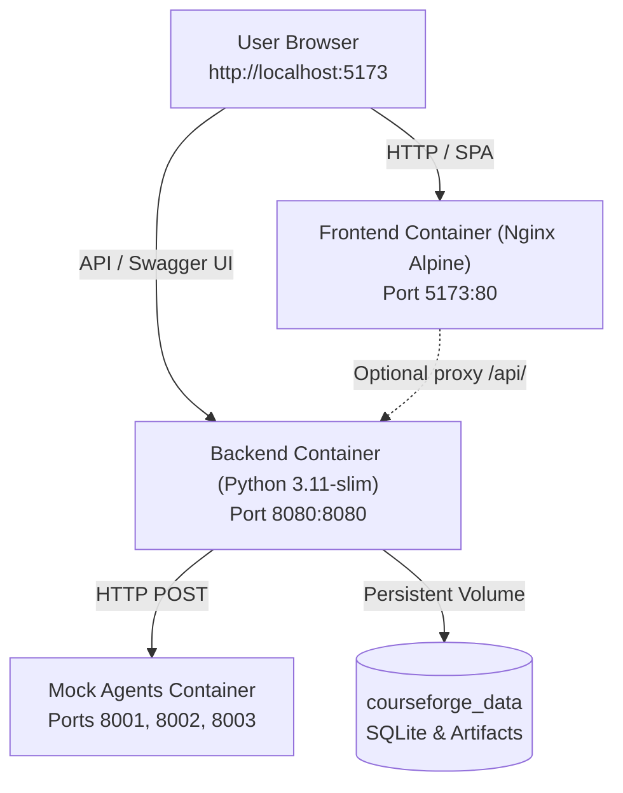

# CourseForge Dockerization Guide

This guide walks you through installing Docker on macOS, running the CourseForge stack (Frontend, Backend, and Mock Agent microservices) via Docker Compose, and managing containers.

---

## 1. Installing Docker on macOS

Since Docker is not installed on your system yet, choose one of the following options:

### Option A: Docker Desktop for Mac (Recommended & Official)
1. Download Docker Desktop from [docker.com/products/docker-desktop](https://www.docker.com/products/docker-desktop/):
   - Choose **Mac with Apple silicon** (M1/M2/M3/M4) or **Mac with Intel chip** depending on your Mac.
2. Open the downloaded `.dmg` file and drag **Docker** to your **Applications** folder.
3. Launch **Docker** from Applications and accept the service agreement.
4. Verify from your terminal:
   ```bash
   docker --version
   docker compose version
   ```

### Option B: OrbStack (Lightweight & Super Fast Alternative)
OrbStack is a fast, native macOS alternative to Docker Desktop that uses significantly less CPU and battery:
1. Download from [orbstack.dev](https://orbstack.dev) or install via Homebrew:
   ```bash
   brew install --cask orbstack
   ```
2. Open OrbStack once to start the background engine.
3. Verify in your terminal:
   ```bash
   docker --version
   docker compose version
   ```

---

## 2. Architecture Overview

When you run `docker compose up`, the following services are launched on a private Docker bridge network (`courseforge-net`):



| Container Name | Service | Host Port | Internal Port | Description |
| :--- | :--- | :--- | :--- | :--- |
| `courseforge-frontend` | `frontend` | `5173` | `80` | Production React SPA served by Nginx |
| `courseforge-backend` | `backend` | `8080` | `8080` | Modular Flask API & Swagger UI |
| `courseforge-mock-agents` | `mock-agents` | `8001, 8002, 8003` | `8001, 8002, 8003` | Standalone mock agent microservices |

---

## 3. Quick Start (One-Command Launch)

From the project root directory (`course-mvp-ui`):

### Step 1: Build and start the containers
```bash
docker compose up --build -d
```
*(Use `-d` to run in detached background mode; omit `-d` to view live logs).*

### Step 2: Seed the database with demo users & sample courses
```bash
docker compose exec backend python app.py seed
```

### Step 3: Run the end-to-end automated smoke test
```bash
docker compose exec backend python app.py smoke
```
You should see:
```text
Smoke test completed successfully.
SMOKE OK
```

---

## 4. Accessing CourseForge

Once the containers are running:

- **Web Application**: Open [http://localhost:5173](http://localhost:5173) in your browser.
  - **Trainer Login**: `trainer@eduserv.com` / `Trainer#2026`
  - **Admin Login**: `admin@eduserv.com` / `Admin#2026`
  - **Reviewer Login**: `reviewer@eduserv.com` / `Reviewer#2026`
- **Swagger UI Interactive API Docs**: [http://localhost:8080/docs](http://localhost:8080/docs)
- **API Health Check**: [http://localhost:8080/health](http://localhost:8080/health)
- **Mock Agents Direct Endpoints**:
  - PPTX Agent: `http://localhost:8001/build-pptx`
  - Lab Agent: `http://localhost:8002/generate-lab`
  - Lab Guide Agent: `http://localhost:8003/generate-guide`

---

## 5. Connecting Real External Agent Microservices

If you or your team have developed standalone agent servers (e.g. running on host ports `9001`, `9002`, `9003` or on separate remote servers):

### Option 1: Agent running on the host machine
In your `.env` or docker-compose environment, use `host.docker.internal`:
```env
AGENT_PPTX_URL=http://host.docker.internal:9001/build-pptx
AGENT_LAB_URL=http://host.docker.internal:9002/generate-lab
AGENT_LAB_GUIDE_URL=http://host.docker.internal:9003/generate-guide
```

### Option 2: Agent running on another server / cloud
```env
AGENT_PPTX_URL=https://agent-pptx.yourcompany.com/generate
AGENT_LAB_URL=https://agent-lab.yourcompany.com/generate
AGENT_LAB_GUIDE_URL=https://agent-guide.yourcompany.com/generate
```

Then restart the backend:
```bash
docker compose up -d backend
```

---

## 6. Daily Operations & Troubleshooting

### View Container Logs
```bash
# View logs from all services
docker compose logs -f

# View logs from backend only
docker compose logs -f backend

# View logs from mock-agents only
docker compose logs -f mock-agents
```

### Restart Services
```bash
docker compose restart
```

### Stop Containers
```bash
docker compose down
```

### Stop Containers & Wipe Data (Clean Reset)
```bash
docker compose down -v
```

### Open a Shell Inside a Container
```bash
# Backend container shell
docker compose exec backend bash

# Frontend Nginx container shell
docker compose exec frontend sh
```
