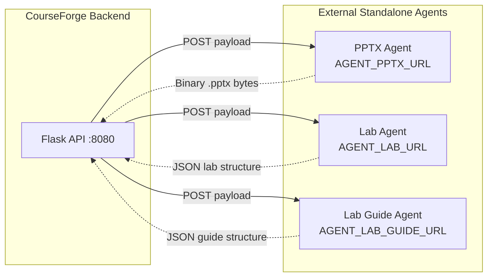

# Agent Integration Guide (`DEVELOPER.md`)

This guide is for developers integrating standalone AI/LLM agent servers with the **CourseForge Backend**.

---

## 1. System Architecture

The CourseForge backend decouples generation workloads to **three standalone HTTP agent microservices**:



Each agent can be built in **any language or framework** (Python/FastAPI, Node.js/Express, Go, LangChain, CrewAI, AutoGen, etc.) and run on its own server, port, or cloud instance.

---

## 2. Scalable Asynchronous Pipeline

To ensure the backend remains highly available while waiting for long-running AI agents (which can take 5+ minutes to generate content), the system uses a fault-tolerant asynchronous task queue powered by **Celery** and **Redis**.

- **Web Requests**: Return immediately with HTTP 200 and are non-blocking. The frontend polls for status updates.
- **Celery Workers**: Run outside the Flask web process and handle the blocking HTTP connections to your standalone agents. If the Flask web server crashes or restarts, Celery guarantees that in-flight background jobs are not lost and database threadlocks do not occur.

### Running the Backend Locally

To test agent integration locally, you must start the Redis broker and the Celery worker alongside the Flask app:

1. **Start Redis**:
   ```bash
   # Via Docker
   docker run -d -p 6379:6379 redis

   # Or via Homebrew (macOS)
   brew services start redis
   ```
2. **Start the Celery Worker**:
   Open a new terminal in the `backend` directory:
   ```bash
   celery -A app.celery worker --pool=threads --loglevel=info
   ```
3. **Start the Flask Server**:
   Open another terminal in the `backend` directory:
   ```bash
   uv run python app.py
   ```

---

## 3. Configuration in Backend

Set the agent endpoints in `backend/.env`:

```env
# ── Agent Microservice Endpoints ────────────────────────────────────────────
AGENT_PPTX_URL=http://localhost:8001/build-pptx
AGENT_LAB_URL=http://localhost:8002/generate-lab
AGENT_LAB_GUIDE_URL=http://localhost:8003/generate-guide

# Request timeout in seconds
AGENT_TIMEOUT_SECONDS=30

# Strict mode: fail at startup if any required URL is missing
REQUIRE_AGENT_ENDPOINTS=true
```

> **Local Development Fallback**: If an agent URL is left blank or unset (and `REQUIRE_AGENT_ENDPOINTS=false`), the backend automatically falls back to local dev stub generators so developers can test without running all agent servers.

---

## 4. Agent 1: PPTX Presentation Agent

### Contract Overview
- **Environment Variable**: `AGENT_PPTX_URL`
- **HTTP Method**: `POST`
- **Request Content-Type**: `application/json`
- **Response Content-Type**: `application/vnd.openxmlformats-officedocument.presentationml.presentation` (or `application/octet-stream`)
- **Response Body**: Raw binary `.pptx` file bytes.

### Request Payload Sent by Backend
```json
{
  "course": {
    "id": "ca07c71b-2d93-46fe-93bf-125d9636e144",
    "title": "Cloud Microservices Mastery",
    "level": "Intermediate",
    "duration": "90 minutes",
    "audience": "Software Engineers",
    "objectives": "Design fault-tolerant services; Implement distributed traces",
    "topics": "Service Mesh; Resilience Patterns; Distributed Tracing",
    "plan": {
      "summary": "Cloud Microservices Mastery · 6 slides",
      "slides": [
        {
          "id": 1,
          "title": "1. Core Concept",
          "heading": "Service Mesh Architecture",
          "body": "• Decouples networking from business logic\n• Provides observability and mTLS",
          "notes": "Speaker notes for slide 1"
        }
      ]
    }
  }
}
```

### Expected Response
- **HTTP Status**: `200 OK`
- **Headers**:
  - `Content-Type: application/vnd.openxmlformats-officedocument.presentationml.presentation`
- **Body**: Valid `.pptx` binary stream.

### Python / FastAPI Reference Implementation
```python
from fastapi import FastAPI, Response
from pydantic import BaseModel

app = FastAPI()

@app.post("/build-pptx")
async def build_pptx(payload: dict):
    course = payload.get("course", {})
    title = course.get("title", "Course Presentation")
    slides = course.get("plan", {}).get("slides", [])

    # Your AI slide generation logic (e.g. using python-pptx)
    # from pptx import Presentation
    # prs = Presentation()
    # ...
    # pptx_bytes = buffer.getvalue()

    with open("template.pptx", "rb") as f:
        pptx_bytes = f.read()

    return Response(
        content=pptx_bytes,
        media_type="application/vnd.openxmlformats-officedocument.presentationml.presentation",
    )
```

---

## 5. Agent 2: Practical Lab Agent

### Contract Overview
- **Environment Variable**: `AGENT_LAB_URL`
- **HTTP Method**: `POST`
- **Request Content-Type**: `application/json`
- **Response Content-Type**: `application/json`
- **Response Body**: Structured lab exercise JSON.

### Request Payload Sent by Backend
```json
{
  "course": {
    "id": "ca07c71b-2d93-46fe-93bf-125d9636e144",
    "title": "Cloud Microservices Mastery",
    "level": "Intermediate",
    "objectives": "Design fault-tolerant services; Implement distributed traces",
    "topics": "Service Mesh; Resilience Patterns; Distributed Tracing"
  },
  "lab_input": {
    "scenario": "Deploy and trace microservices in Kubernetes",
    "environment": "Kubernetes Minikube + Istio",
    "assets": "Starter repo"
  }
}
```

### Expected JSON Response Format
Your agent must return either `{"lab": { ... }}` or the lab dictionary directly:

```json
{
  "lab": {
    "scenario": "Deploy and trace microservices in Kubernetes",
    "environment": "Kubernetes Minikube + Istio",
    "assets": "Lab repository starter files, evaluation rubric",
    "tasks": [
      {
        "n": 1,
        "title": "Configure Runtime Environment & Dependencies",
        "detail": "Clone the starter repository, inspect environment configuration, and install dependencies.",
        "time": "15 min"
      },
      {
        "n": 2,
        "title": "Implement the Core Agent Workflow",
        "detail": "Wire the request handler to parse incoming telemetry and log structured metrics.",
        "time": "30 min"
      },
      {
        "n": 3,
        "title": "Execute Verification Suite & Benchmark Latency",
        "detail": "Run integration tests and confirm all evaluation criteria and assertions pass.",
        "time": "15 min"
      }
    ],
    "criteria": [
      "Service successfully starts and passes automated health check assertions",
      "Core workflow correctly handles edge cases without unhandled exceptions",
      "Telemetry output conforms to the structured JSON schema"
    ],
    "code": {
      "language": "javascript",
      "files": [
        {
          "path": "lab/starter.js",
          "content": "// Starter code for the hands-on lab\nexport function run() {\n  return true;\n}\n"
        }
      ]
    },
    "useCase": "Apply microservice resilience patterns in a guided exercise."
  }
}
```

### Python / FastAPI Reference Implementation
```python
from fastapi import FastAPI

app = FastAPI()

@app.post("/generate-lab")
async def generate_lab(payload: dict):
    course = payload.get("course", {})
    lab_input = payload.get("lab_input", {})
    title = course.get("title", "Hands-on Lab")

    # Call your LLM / agent chain to create tasks and starter code
    return {
        "lab": {
            "scenario": lab_input.get("scenario") or f"Hands-on exercise for {title}",
            "environment": lab_input.get("environment") or "Docker container",
            "assets": "Sample configs, automated test suite",
            "tasks": [
                {"n": 1, "title": "Setup Workspace", "detail": "Prepare tools", "time": "10 min"},
                {"n": 2, "title": "Implement Solution", "detail": "Write code", "time": "25 min"},
                {"n": 3, "title": "Validate Outcomes", "detail": "Run checks", "time": "15 min"}
            ],
            "criteria": ["All tests pass", "Zero linter warnings"],
            "code": {
                "language": "javascript",
                "files": [
                    {"path": "solution.js", "content": "// Starter implementation\n"}
                ]
            },
            "useCase": f"Practical application of {title}"
        }
    }
```

---

## 6. Agent 3: Lab Guide Agent

### Contract Overview
- **Environment Variable**: `AGENT_LAB_GUIDE_URL`
- **HTTP Method**: `POST`
- **Request Content-Type**: `application/json`
- **Response Content-Type**: `application/json`
- **Response Body**: Structured multi-page guide documentation JSON.

### Request Payload Sent by Backend
```json
{
  "course": {
    "id": "ca07c71b-2d93-46fe-93bf-125d9636e144",
    "title": "Cloud Microservices Mastery",
    "objectives": "Design fault-tolerant services; Implement distributed traces"
  },
  "lab": {
    "scenario": "Deploy and trace microservices in Kubernetes",
    "environment": "Kubernetes Minikube + Istio",
    "tasks": [ ... ],
    "criteria": [ ... ]
  }
}
```

### Expected JSON Response Format
Your agent must return either `{"guide": { ... }}` or the guide dictionary directly:

```json
{
  "guide": {
    "title": "Cloud Microservices Mastery Lab Guide",
    "outcomes": [
      "Understand system architecture and runtime constraints",
      "Complete guided hands-on implementation steps",
      "Validate outcomes against evaluation rubrics"
    ],
    "pages": [
      {
        "id": "overview",
        "label": "Overview",
        "kicker": "GETTING STARTED",
        "title": "Lab Architecture & Objectives",
        "lede": "Welcome to the hands-on lab. In this exercise, you will provision architecture using code."
      },
      {
        "id": "setup",
        "label": "Setup",
        "kicker": "ENVIRONMENT",
        "title": "Workspace & Tooling Configuration",
        "lede": "Confirm your containerized workspace is online before starting the tasks."
      },
      {
        "id": "walkthrough",
        "label": "Walkthrough",
        "kicker": "EXECUTION",
        "title": "Step-by-Step Exercise Execution",
        "lede": "Follow each milestone in sequential order, validating intermediate state as you proceed."
      },
      {
        "id": "verification",
        "label": "Verification",
        "kicker": "EVALUATION",
        "title": "Assessment & Success Verification",
        "lede": "Verify your finished implementation against the success rubric and run automated checks."
      }
    ]
  }
}
```

---

## 7. Node.js / Express Example (All 3 in One Service)

If you prefer building in TypeScript / JavaScript:

```javascript
const express = require('express');
const fs = require('fs');
const app = express();

app.use(express.json());

// 1. PPTX Agent
app.post('/build-pptx', (req, res) => {
  const pptxBuffer = fs.readFileSync('template.pptx');
  res.set('Content-Type', 'application/vnd.openxmlformats-officedocument.presentationml.presentation');
  res.send(pptxBuffer);
});

// 2. Lab Agent
app.post('/generate-lab', (req, res) => {
  const { course, lab_input } = req.body;
  res.json({
    lab: {
      scenario: lab_input?.scenario || course?.title,
      environment: lab_input?.environment || 'Cloud IDE',
      assets: 'Starter repo',
      tasks: [
        { n: 1, title: 'Environment Setup', detail: 'Prepare workspace', time: '10 min' },
        { n: 2, title: 'Core Implementation', detail: 'Complete tasks', time: '30 min' },
        { n: 3, title: 'Evaluation', detail: 'Check rubric', time: '15 min' }
      ],
      criteria: ['Passes verification tests'],
      code: {
        language: 'javascript',
        files: [{ path: 'lab/starter.js', content: '// Starter code\n' }]
      },
      useCase: 'Hands-on practice'
    }
  });
});

// 3. Lab Guide Agent
app.post('/generate-guide', (req, res) => {
  const { course } = req.body;
  res.json({
    guide: {
      title: `${course?.title || 'Lab'} Guide`,
      outcomes: ['Understand concepts', 'Complete tasks'],
      pages: [
        { id: 'overview', label: 'Overview', kicker: 'INTRO', title: 'Overview', lede: 'Getting started' },
        { id: 'walkthrough', label: 'Walkthrough', kicker: 'STEPS', title: 'Steps', lede: 'Guided steps' }
      ]
    }
  });
});

app.listen(8001, () => console.log('Agent server listening on port 8001'));
```

---

## 8. Verifying Integration

### 1. Check Backend Health
Query the backend health route to confirm your endpoints are recognized:
```bash
curl http://127.0.0.1:8080/health
```
Output:
```json
{
  "agent_endpoints": {
    "pptx": "http://localhost:8001/build-pptx",
    "lab": "http://localhost:8002/generate-lab",
    "lab_guide": "http://localhost:8003/generate-guide"
  },
  "agents": "configured",
  "ok": true
}
```

### 2. Run End-to-End Smoke Test
Run the automated test which creates a test course and hits all three agent endpoints in sequence:
```bash
cd backend
uv run python app.py smoke
```
You should see incoming requests in your agent server logs:
```text
POST /build-pptx -> 200 OK
POST /generate-lab -> 200 OK
POST /generate-guide -> 200 OK
```
And the smoke test completes with:
```text
SMOKE OK
```

---

## 9. Reference Implementation

Check [`backend/mock_agents_server.py`](file:///Users/uvarajj/Documents/Thamilselvan/eduservit/course-mvp-ui/backend/mock_agents_server.py) for an active, working standalone server demonstrating all three endpoints with request logging and CORS support.
