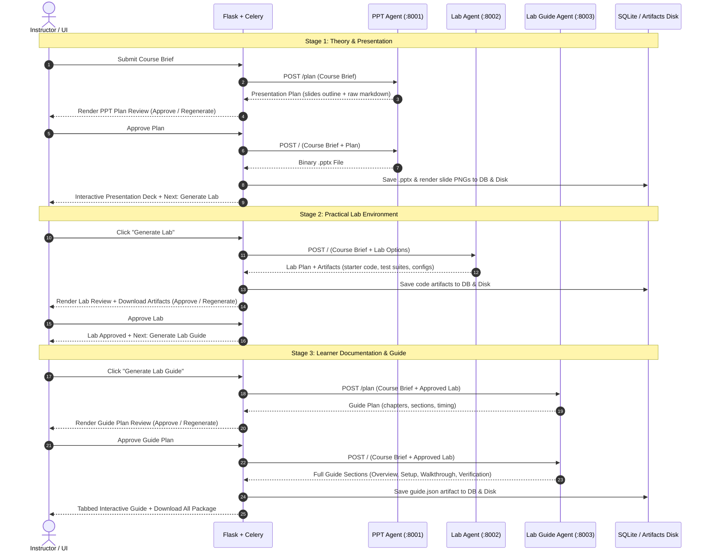

# EduServ IT — Agent Integration Guide & API Contract

This document provides the end-to-end integration specifications, data contracts, and endpoint-level schemas for connecting AI Agent microservices (PPT Agent, Lab Agent, and Lab Guide Agent) to the EduServ IT course creation pipeline.

---

## 1. System Architecture & Workflow Flow

The platform separates course creation into 3 distinct agent stages. Each agent follows a decentralized **Plan → Review → Approve → Generate → Complete** lifecycle.



---

## 2. Course Brief Schema (Shared Input)

Whenever the backend contacts an agent, it sends the normalized **Course Brief** payload in the request body. Agents use these fields to ground their generation.

### JSON Payload Schema
```json
{
  "id": "7966d004-3f17-4959-887e-13bc74d71e86",
  "title": "Event-Driven Microservices with Kafka",
  "description": "Architecting resilient distributed event-driven systems using Apache Kafka and Node.js.",
  "topics": "Event Sourcing\nCQRS\nKafka Consumer Groups\nIdempotency",
  "objectives": "Implement Kafka consumer idempotency\nHandle rebalancing and poisoned pills\nVerify end-to-end message delivery",
  "level": "Intermediate",
  "duration": "45 min",
  "language": "English",
  "category": "Cloud & Distributed Systems",
  "persona": "Backend Software Engineers",
  "prerequisites": "Working knowledge of Node.js and Docker fundamentals",
  "status": "PPT_PLAN_REVIEW",
  "created_at": "2026-09-22T04:00:00Z"
}
```

---

## 3. Agent 1: PPT Agent (PowerPoint & Slide Outline)

- **Default Port**: `8001`
- **Config Key**: `AGENT_PPTX_URL=http://localhost:8001`

### Endpoint 1.1: Generate Presentation Plan Outline
*Used during initial course submission or when the user clicks "Regenerate Plan".*

- **Method**: `POST`
- **Path**: `/plan` (or `/api/plan`)
- **Request Body**:
  ```json
  {
    "course": { ...course_brief_json... }
  }
  ```

- **Expected Response (`200 OK`)**:
  ```json
  {
    "summary": "Event-Driven Microservices · 45 min · Intermediate · 6 slides",
    "sections": 6,
    "duration": "30 min",
    "raw": "# Presentation Outline\n\n** Core Concept **\n- Event streaming vs traditional request-response\n- Decoupling producers and consumers\n\n** Architecture **\n- Kafka Brokers, Topics, Partitions, and Consumer Groups\n\n** Real-World Patterns **\n- Implementing at-least-once vs exactly-once semantics\n\n** Failure Modes **\n- Handling poison pills and network partitions\n\n** Best Practices **\n- Idempotent consumer design\n\n** Summary **\n- Key takeaways and transition to hands-on lab",
    "slides": [
      {
        "id": 1,
        "title": "1. Core Concept",
        "kicker": "FOUNDATION",
        "heading": "Event Streaming vs Request-Response",
        "body": "• Asynchronous event logs replace point-to-point HTTP coupling.\n• Producers emit immutable state events without knowing downstream consumers.\n• Enables real-time scalability and auditability.",
        "notes": "Introduce the motivation. Emphasize why REST fails under high event throughput."
      },
      {
        "id": 2,
        "title": "2. Kafka Architecture",
        "kicker": "ARCHITECTURE",
        "heading": "Brokers, Topics, and Partitions",
        "body": "• Topics are partitioned logs distributed across cluster brokers.\n• Partitioning determines consumer parallelism.\n• Consumer groups scale out reads cooperatively.",
        "notes": "Point out the relationship between partition count and consumer group size."
      }
    ]
  }
  ```

---

### Endpoint 1.2: Generate Binary Presentation Deck (.pptx)
*Invoked when the instructor clicks "Approve & Generate Slides".*

- **Method**: `POST`
- **Path**: `/` (or configured `AGENT_PPTX_URL`)
- **Request Body**:
  ```json
  {
    "course": {
      ...course_brief_json...,
      "ppt_plan": { ...approved_plan_from_step_1_1... }
    }
  }
  ```

- **Expected Response (`200 OK`)**:
  - **Content-Type**: `application/vnd.openxmlformats-officedocument.presentationml.presentation`
  - **Body**: Raw binary `.pptx` file stream.

- **Backend Ingestion**:
  1. The backend writes the stream to `backend/artifacts/<course_id>/<slug>-theory.pptx`.
  2. LibreOffice converts the presentation to high-resolution slide PNG images for instant in-browser viewing.
  3. Registers the artifact in the database table `artifacts` with `type="ppt"`.

---

### Endpoint 1.3: Tagged Slide Single-Slide Regeneration
*Invoked when the instructor highlights a slide in the deck and clicks "Regenerate Slide".*

- **Method**: `POST`
- **Path**: `/slides/regenerate`
- **Request Body**:
  ```json
  {
    "course": { ...course_brief_json... },
    "slides": [2],
    "prompt": "Focus more on partition rebalancing and lag monitoring.",
    "notes": "Include metrics from Prometheus."
  }
  ```

- **Expected Response (`200 OK`)**:
  ```json
  {
    "slides": [ ...updated_slides_array... ]
  }
  ```

---

## 4. Agent 2: Practical Lab Agent (Lab Exercise & Artifacts)

- **Default Port**: `8002`
- **Config Key**: `AGENT_LAB_URL=http://localhost:8002`

### Endpoint 2.1: Generate Hands-on Lab & Code Artifacts
*Invoked when user clicks "Generate Lab" or "Regenerate Lab".*

- **Method**: `POST`
- **Path**: `/` (or configured `AGENT_LAB_URL`)
- **Request Body**:
  ```json
  {
    "course": { ...course_brief_json... },
    "lab_input": {
      "scenario": "Implement Idempotent Kafka Consumer with Redis Deduplication",
      "environment": "Node.js 20 / Docker",
      "assets": "Starter repository with docker-compose.yml"
    }
  }
  ```

- **Expected Response (`200 OK`)**:
  The agent returns the Markdown lab specification **and an array of code artifacts**:
  ```json
  {
    "lab": {
      "raw": "# Kafka Idempotency Lab\n\n**Scenario:** Implement an idempotent event processor.\n\n## Objectives\n- Connect to the Kafka broker\n- Implement Redis message key check before processing\n- Acknowledge offset only upon success\n\n## Tasks\n1. Start local broker: `docker-compose up -d`\n2. Fill in `consumer.js`\n3. Run validation tests: `npm test`",
      "environment": "Node.js 20 / Redis / Kafka",
      "estimated_time": 45,
      "artifacts": [
        {
          "name": "consumer.js",
          "label": "Starter Consumer Implementation",
          "type": "lab-starter",
          "mime_type": "text/javascript",
          "content": "const { Kafka } = require('kafkajs');\n// TODO: Implement deduplication\n"
        },
        {
          "name": "test_consumer.js",
          "label": "Automated Verification Test Suite",
          "type": "lab-test",
          "mime_type": "text/javascript",
          "content": "const assert = require('assert');\ndescribe('Idempotency Test', () => { it('deduplicates duplicate keys', () => {}); });\n"
        },
        {
          "name": "docker-compose.yml",
          "label": "Local Docker Environment",
          "type": "lab-config",
          "mime_type": "text/yaml",
          "content": "version: '3.8'\nservices:\n  zookeeper:\n    image: confluentinc/cp-zookeeper:latest\n  kafka:\n    image: confluentinc/cp-kafka:latest\n"
        }
      ]
    }
  }
  ```

- **Backend Ingestion & Database Persistence**:
  1. The backend reads each item in `artifacts` (or `files`).
  2. Writes the code file into `backend/artifacts/<course_id>/<name>`.
  3. Inserts each file as an `Artifact` in the database with its `label`, `mime_type`, `type`, and `size_label`.
  4. The UI renders each artifact in the "Generated Artifacts" inspector list with a download button.

---

## 5. Agent 3: Lab Guide Agent (Learner Documentation)

- **Default Port**: `8003`
- **Config Key**: `AGENT_LAB_GUIDE_URL=http://localhost:8003`

### Endpoint 3.1: Generate Lab Guide Plan
*Invoked when user moves to Step 3 and clicks "Generate Lab Guide Plan" or "Regenerate Plan".*

- **Method**: `POST`
- **Path**: `/plan` (or `{AGENT_LAB_GUIDE_URL}/plan`)
- **Request Body**:
  ```json
  {
    "course": { ...course_brief_json... },
    "lab": { ...approved_lab_json_and_artifacts... },
    "stage": "plan"
  }
  ```

- **Expected Response (`200 OK`)**:
  ```json
  {
    "plan": {
      "title": "Event-Driven Microservices - Lab Guide Plan",
      "estimated_time": 45,
      "target_audience": "Intermediate",
      "sections": ["Overview", "Setup", "Walkthrough", "Verification"],
      "chapters": [
        {
          "title": "1. Overview & Objectives",
          "desc": "System architecture, Kafka topic topologies, and prerequisite credentials."
        },
        {
          "title": "2. Environment Setup",
          "desc": "Bootstrapping Docker containers and configuring Kafka client connection string."
        },
        {
          "title": "3. Guided Walkthrough",
          "desc": "Step-by-step milestones: listener setup, Redis lock check, and offset commits."
        },
        {
          "title": "4. Verification Rubric",
          "desc": "Running automated test assertions and evaluating throughput."
        }
      ],
      "raw": "# Lab Guide Plan\n\nThis plan outlines the structure of the final learner guide documentation..."
    }
  }
  ```

- **UI Rendering**:
  - The UI displays the Markdown preview card on the left.
  - The right sidebar renders the chapter breakdown cards and timing badges.
  - Action buttons: `Approve & Generate Guide →` and `Regenerate Plan`.

---

### Endpoint 3.2: Generate Full Step-by-Step Lab Guide
*Invoked when the instructor clicks "Approve & Generate Guide".*

- **Method**: `POST`
- **Path**: `/` (or configured `AGENT_LAB_GUIDE_URL`)
- **Request Body**:
  ```json
  {
    "course": { ...course_brief_json... },
    "lab": { ...approved_lab_json_and_artifacts... }
  }
  ```

- **Expected Response (`200 OK`)**:
  ```json
  {
    "guide": {
      "title": "Event-Driven Microservices - Learner Guide",
      "outcomes": [
        "Provision a local Kafka broker environment using Docker",
        "Implement deduplicated message processing using Redis keys",
        "Execute automated test assertions with zero dropped events"
      ],
      "pages": [
        {
          "id": "overview",
          "label": "Overview",
          "kicker": "GETTING STARTED",
          "title": "Lab Architecture & Prerequisites",
          "lede": "Understand the event topology and dependencies before initiating the exercise.",
          "content": "### Welcome to the Kafka Idempotency Lab\n\nIn this lab, you will prevent duplicate processing in distributed consumer groups...\n\n#### Prerequisites\n- Node.js 20+\n- Docker Desktop"
        },
        {
          "id": "setup",
          "label": "Setup",
          "kicker": "ENVIRONMENT",
          "title": "Workspace & Container Configuration",
          "lede": "Launch the local broker, topic partitioners, and state store.",
          "content": "### Step 1: Start Docker Services\n```bash\ndocker-compose up -d\n```\nVerify that both ZooKeeper, Kafka, and Redis containers are healthy."
        },
        {
          "id": "walkthrough",
          "label": "Walkthrough",
          "kicker": "EXECUTION",
          "title": "Guided Implementation Steps",
          "lede": "Follow each milestone sequentially.",
          "content": "### Milestone 1: Instantiate the Consumer\nOpen `consumer.js` and initialize the Kafka client...\n\n### Milestone 2: Atomic State Deduplication\nCheck Redis for `msg.eventId` before processing."
        },
        {
          "id": "verification",
          "label": "Verification",
          "kicker": "EVALUATION",
          "title": "Automated Validation & Evaluation",
          "lede": "Validate outcomes against the success rubric.",
          "content": "### Execute the Test Suite\n```bash\nnpm test\n```\n**Expected Outcome:** All test suites pass with green status."
        }
      ]
    }
  }
  ```

- **Backend Ingestion**:
  1. The backend writes the guide to `backend/artifacts/<course_id>/<slug>-guide.json`.
  2. Saves the artifact in the database.
  3. Transitions status to `COMPLETE`.
  4. The UI renders the clean tabbed reader (Overview, Setup, Walkthrough, Verification) with individual Markdown views and full download option.

---

## 6. How to Configure and Swap Agents in Backend

In `backend/.env`, set the respective agent endpoints:

```ini
# Real Agent Microservice URLs
AGENT_PPTX_URL=http://localhost:8001
AGENT_LAB_URL=http://localhost:8002
AGENT_LAB_GUIDE_URL=http://localhost:8003

# Timeout settings (in seconds)
AGENT_TIMEOUT=180
```

> **Note on Fallback Mode**: If any of these URL variables are commented out or left blank, the backend automatically uses its dynamic internal generators (`backend/agents/pptx_agent.py`, `backend/agents/lab_agent.py`, `backend/agents/guide_agent.py`) so local development never breaks.

---

## 7. Testing Your Agents with Standalone Server

A reference implementation of all 3 agents is included in `backend/mock_agents_server.py`. You can run it to verify integration:

```bash
# In the backend directory:
source .venv/bin/activate
python mock_agents_server.py
```

This starts:
- `http://localhost:8001` — Mock PPT Agent
- `http://localhost:8002` — Mock Lab Agent
- `http://localhost:8003` — Mock Lab Guide Agent

You can test each agent with standard `curl` commands:
```bash
# Test PPT Plan:
curl -X POST http://localhost:8001/plan \
  -H "Content-Type: application/json" \
  -d '{"course": {"title": "Distributed Systems", "objectives": "Consensus; Paxos; Raft"}}'

# Test Lab Generation:
curl -X POST http://localhost:8002/ \
  -H "Content-Type: application/json" \
  -d '{"course": {"title": "Distributed Systems"}}'

# Test Guide Plan:
curl -X POST http://localhost:8003/plan \
  -H "Content-Type: application/json" \
  -d '{"course": {"title": "Distributed Systems"}, "lab": {"environment": "Go 1.22"}}'
```
